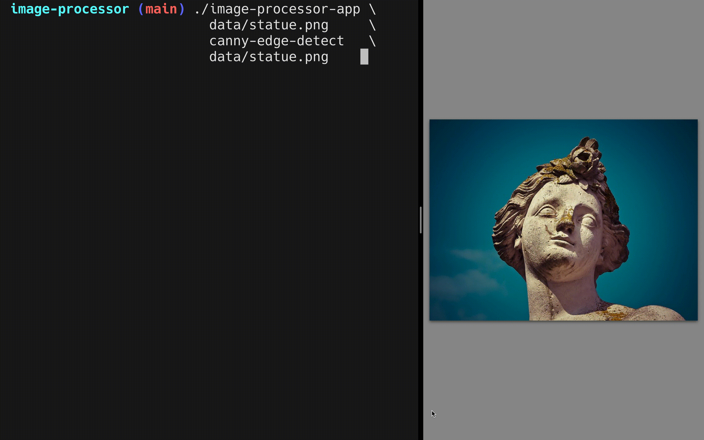

# overview

My program takes an input image, which is typically a digital image represented as a rectangular grid of pixels. Each pixel contains RGB values which I store into an array to perform basic filter operations on. Once a filter operation is applied to the pixels in the image, the modified image is stored as a separate specified output image.

# supported features

Currently, I support the following filter operations...

- canny-edge-detect
- double-threshold
- gaussian-blur
- greyscale
- hysteresis
- invert
- mean-blur
- non-max
- purplescale
- sharpening
- sobel
- solarization
- threshold
- threshold-low
- threshold-high

The first option, `canny-edge-detect` actually chains `greyscale`, `gaussian-blur`, `sobel`, `non-max`, `double-threshold`, and `hysteresis` together. This provides a useful representation of the object boundaries and structural information within the image.

# example

# source

You can find my repo at [https://github.com/fmgornick/image-processor](https://github.com/fmgornick/image-processor)
